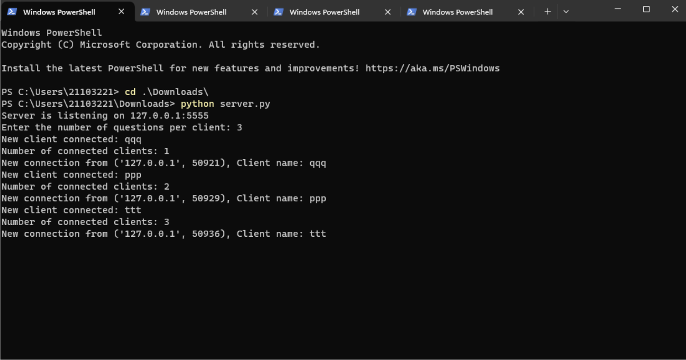
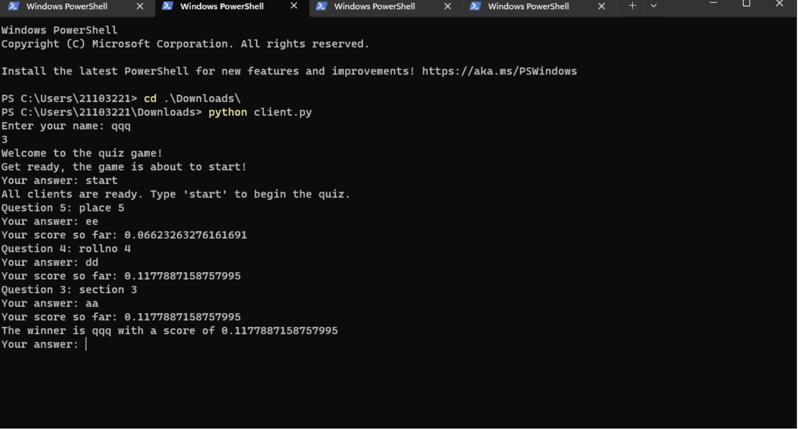
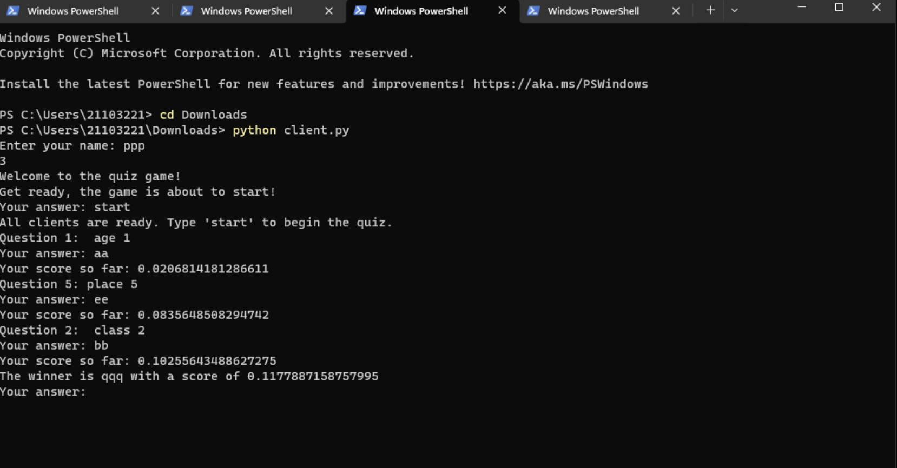
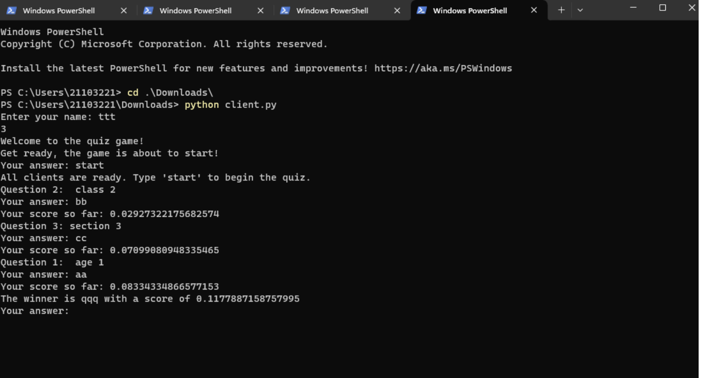

# 🧠 Real-Time Multiplayer Quiz Game using Sockets in Python

This project is a **real-time multiplayer quiz game** built using Python's socket programming and threading. It allows multiple clients to connect to a central server, receive quiz questions in real time, and compete for the highest score based on correctness and response speed.

The server hosts the quiz questions stored in an Excel sheet, and distributes them to all connected players. The game is dynamic, interactive, and perfect for learning the fundamentals of networking, concurrency, and I/O in Python.

---

## 🚀 Features

- Multi-client support using Python `threading`
- Real-time question delivery from Excel
- Scoring based on **accuracy + speed**
- Winner announcement after all clients finish
- Easily extendable and customizable

---

## 📁 Project Structure

📂 quiz-game/ ├── server.py # Server that handles all client connections and quiz logic ├── client.py # Client that connects to the server and participates in the quiz ├── questions.xlsx # Excel file containing quiz questions, answers, and weightage


---

## 📝 Excel Format (`questions.xlsx`)

Ensure your `questions.xlsx` file follows this structure:

| question no | question                          | answer  | weightage |
|-------------|-----------------------------------|---------|-----------|
| 1           | What is the capital of France?    | Paris   | 10        |
| 2           | Who wrote Hamlet?                 | Shakespeare | 15     |
| ...         | ...                               | ...     | ...       |

---

## ⚙️ Prerequisites

- Python 3.x
- `pandas` library
- `openpyxl` (for Excel reading)

Install dependencies using:

```bash
pip install pandas openpyxl


## ⚙️ Prerequisites

- Python 3.x
- `pandas` library
- `openpyxl` (for Excel reading)

Install dependencies using:

pip install pandas openpyxl


🖥️ How to Run the Project

1. Clone the Repository

git clone https://github.com/your-username/quiz-game.git
cd quiz-game

2. Edit the Questions File
Make sure questions.xlsx is in the same directory as server.py and formatted correctly (see example above).

3. Start the Server
Run the server in one terminal:
python server.py

You’ll be prompted to enter the number of questions each client will receive.

4. Start Clients
In separate terminal windows (or different machines on the same network), run the client:

python client.py
Each client will enter their name, and after all are connected and ready, one can type start to begin the quiz.

🏆 Scoring Logic
Each question has a weightage value.

Correct answers are rewarded based on how fast the response is:

Score = weightage × (1 / time taken)

The player with the highest cumulative score wins!

## 🖼️ Screenshots

### 🖥️ Server Running


### 👨‍💻 Client Playing



### 🏆 Winner Announcement
